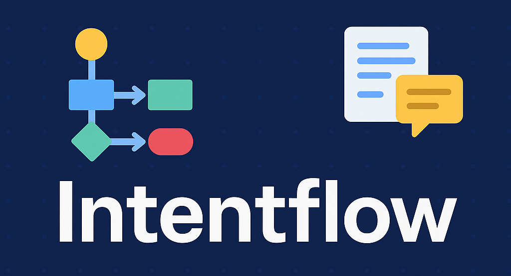

# Intentflow



Intentflow is an open-source **UX flow framework** that lets product teams ship contextual onboarding, nudges, and promotions in minutes—not days.

## ✨ Why Intentflow?

* **Declarative** – author complex interaction flows in simple YAML.
* **Stateful** – flags track user milestones across pages and sessions.
* **Pluggable** – integrate analytics (PostHog), LLMs (ChatGPT, Claude, Gemini) or your own logic to decide which component to show.
* **Framework-agnostic** – React-first, with Vue/Svelte adapters on the roadmap.

Use it to:

| Outcome                               | Example Context                           | Component  |
|---------------------------------------|-------------------------------------------|------------|
| Increase trial → paid conversions      | User viewed pricing but didn't upgrade    | Modal      |
| Collect qualified leads               | User hit a feature paywall                | Banner     |
| Guide power users to hidden gems      | User hovers a rarely-used feature toggle  | Tooltip    |
| Drive webinar sign-ups                | Docs readers spending >3 min on tutorials | Modal      |

---

## 🏃‍♂️ Quick Start

```bash
# 1. Install peer deps
npm install react
# 2. Install Intentflow (local workspace)
npm install ./
```

```tsx
import {
  IntentflowProvider,
  useUXFlag,
  useUXStep,
  useUXGoal,
  Modal,
} from 'intentflow';

function App() {
  return (
    <IntentflowProvider>
      <YourRoutes />
    </IntentflowProvider>
  );
}
```

### Example YAML Flow

```yaml
# public-flows/example.yaml

goals:
  schedule_meeting:
    steps:
      - id: viewed_pricing
        event: page_view
        path: "/pricing"
        set_flag: viewed_pricing
      - id: clicked_cta
        event: click
        selector: ".cta-button"
        requires_flags: [viewed_pricing]
        set_flag: interested_user
```

Load and evaluate this flow:

```ts
import { loadFlowFile } from 'intentflow';

const flow = loadFlowFile('public-flows/example.yaml');
```

---

## 📈 Analytics Integration (PostHog)

```ts
import { initPostHog } from 'intentflow/core/analytics';

initPostHog(process.env.PUBLIC_POSTHOG_KEY!, {
  api_host: 'https://app.posthog.com',
  autocapture: false,
});
```

Every time a flag is set, Intentflow automatically fires `intentflow_flag_set` to PostHog. You can subscribe to additional events via your own code or use PostHog dashboards to correlate UX experiments with conversions.

---

## 🤖 LLM-Driven Decisioning

Intentflow ships with a lightweight `Evaluator` that can call **ChatGPT (OpenAI)**, **Gemini (Google)**, or **Claude (Anthropic)** to decide which components to render.

```ts
import { Evaluator } from 'intentflow';

const evaluator = new Evaluator('openai', process.env.OPENAI_API_KEY!);

const decision = await evaluator.evaluate({
  flags: { viewed_pricing: true },
  components: [{ id: 'modal1', type: 'modal' }],
  goal: 'schedule_meeting',
  page: '/pricing',
});

// decision.render -> ['modal1']
// decision.set_flags -> ['modal_shown']
```

Swap providers with a single arg:

```ts
new Evaluator('gemini', GCP_API_KEY);
new Evaluator('claude', ANTHROPIC_KEY);
```

---

## 🗺 Roadmap / Contributing

* Flag expiration & storage adapters
* Flow chaining & A/B testing
* CLI `create-intentflow-app` scaffold
* Additional UI kits (Chakra, Tailwind)

PRs & issues welcome! 🎉
